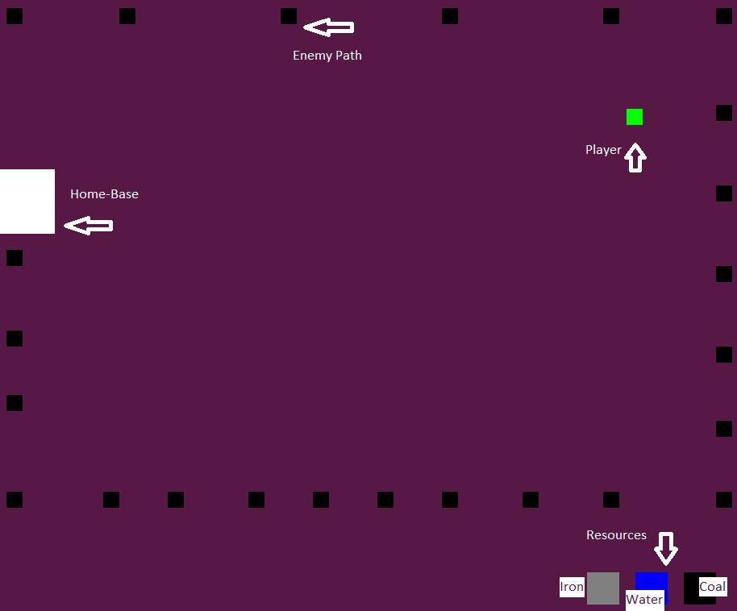
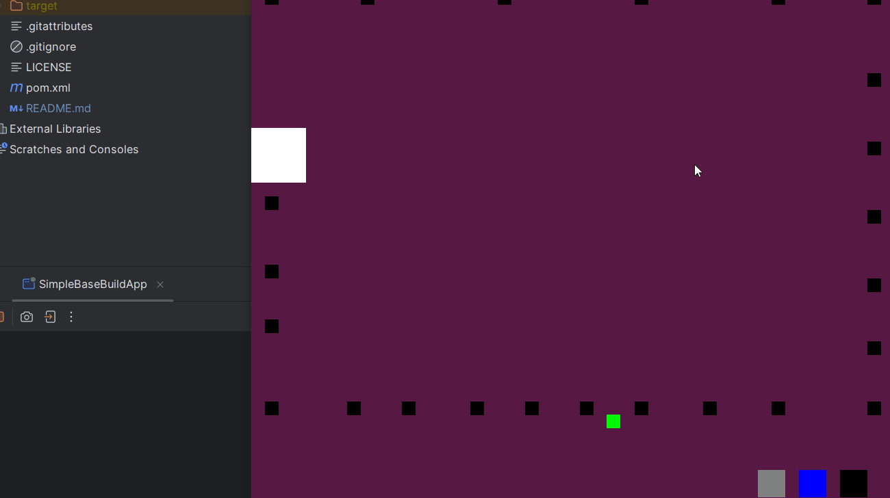
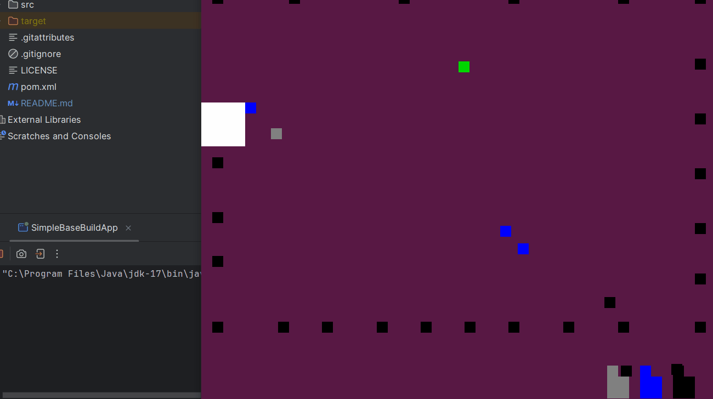

# SimpleBaseBuild
 This is a simple base-building experience created solely in Java 17 using JFrame and Canvas.

Although this is a simple base building POC, it includes few of the advanced topics such as
1. Pathfinding(AStart-Completed, VectorFlowField-TO-DO)
2. Collision Detection(Completed)
3. Object State Machine Implementation(In-Progress)
4. Object Mapping(Completed)
5. Resource Handler(TO-DO)
6. Object Tracker(TO-DO)
7. Priority Queue Implementation(TO-DO)
8. Perlin-Noise-Implementation(TO-DO)
9. Map-Generation with different tile-types(In-Progress)

Check out below snippets and action so far.

So far, the base version has completed implementations

1. A* Pathfinding
2. Object Collision
3. Worker-Gatherer Queue
4. Map-Generation

#Map-Explanation - 01

#Player-Resource-Gathering - 02

#Resource-Gatherers(Workers) with pathfinding - 03

